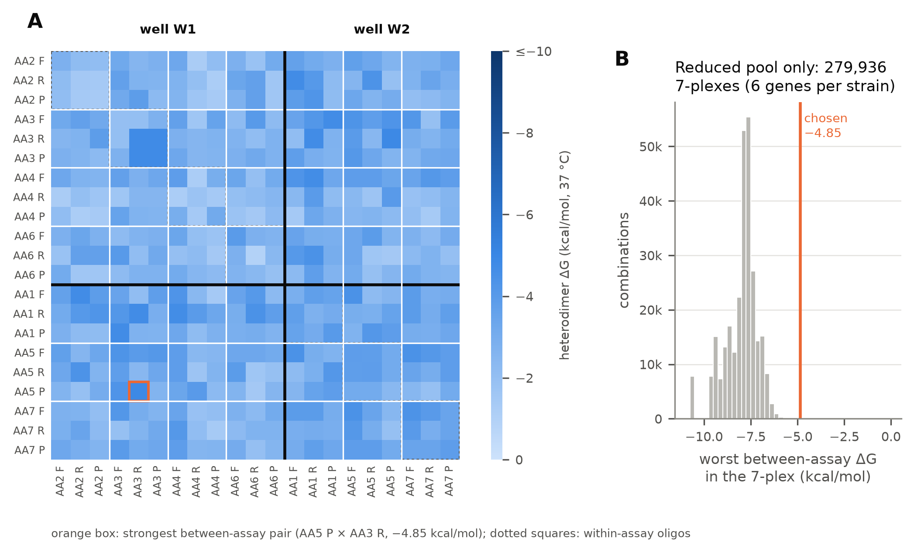
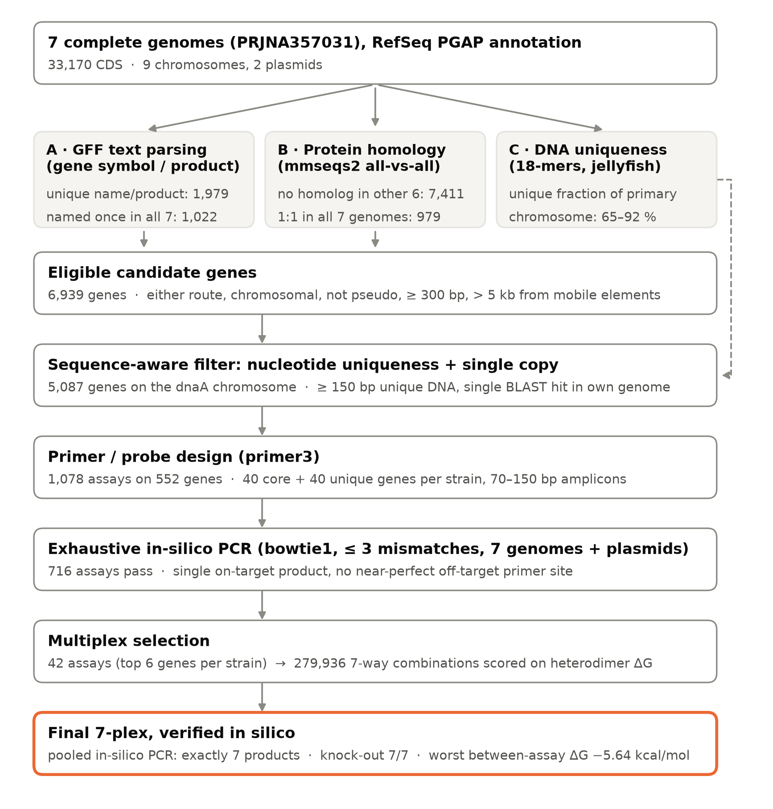
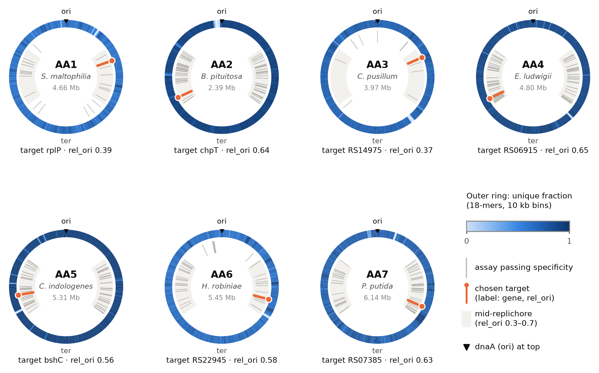
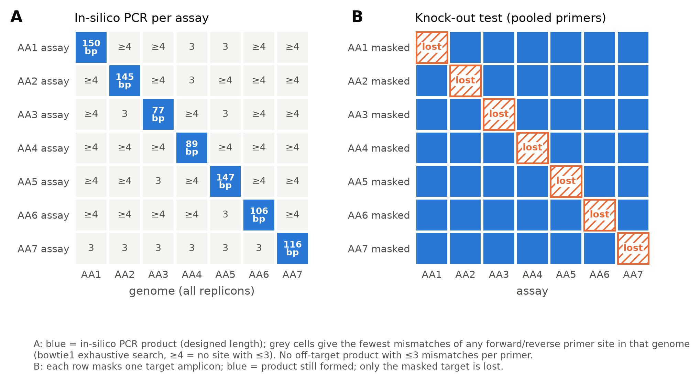
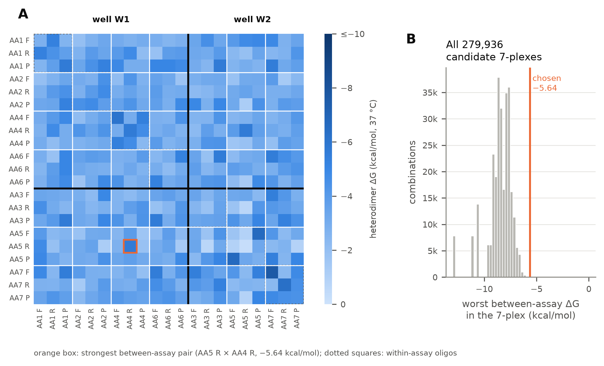

# 7SynCom_Kolter: multiplex dPCR assays for the maize root SynCom

Goal: design primer + hydrolysis-probe sets that can be multiplexed in **digital PCR**, one per strain. Each set targets a **single-copy chromosomal locus found only in that strain**. They are used to measure the absolute DNA abundance of each member in mixed samples of these 7 strains only (DNA, not expression).

Reference: Niu B, Paulson JN, Zheng X, Kolter R (2017). *Simplified and representative bacterial community of maize roots.* PNAS 114:E2450–E2459. Genomes: BioProject **PRJNA357031**.

## Status (2026-10-01): design complete and verified in silico

The seven assays are in `primer_design/results/oligos.tsv` (order sheet) and `final_multiplex.tsv` (all details). This set replaces the first one (repository history up to commit `08c73d3`), in which AA1 targeted the core gene *rplP*. Strain-uniqueness by homology is now the first selection criterion, so every target is a gene with no homolog in the other six genomes.

| Strain | Species (NCBI) | Target locus | Product | Route | rel_ori | Amplicon | Well (4+3) |
|---|---|---|---|---|---|---|---|
| AA1 | *S. maltophilia* | BTU49_RS14340 | tetratricopeptide repeat protein | unique (homology) | 0.46 | 150 bp | W1 |
| AA2 | *B. pituitosa* | BUE85_RS08015 *bspB* | type IV secretion system effector BspB | unique, both routes | 0.58 | 145 bp | W1 |
| AA3 | *C. pusillum* | BUE88_RS07895 | DUF6507 family protein | unique (homology) | 0.37 | 77 bp | W2 |
| AA4 | *E. ludwigii* | BUE86_RS06930 *hcp* | hydroxylamine reductase | unique, both routes | 0.65 | 89 bp | W1 |
| AA5 | *C. indologenes* | BUE84_RS12740 *pepE* | dipeptidase PepE | unique, both routes | 0.40 | 147 bp | W2 |
| AA6 | *H. robiniae* | BUQ72_RS24105 | hypothetical protein | unique (homology) | 0.67 | 106 bp | W1 |
| AA7 | *P. putida* | BUQ73_RS06845 *rssC* | anti-sigma factor antagonist RssC | unique, both routes | 0.59 | 116 bp | W2 |

`rel_ori` is the target's distance from the replication origin (dnaA): 0 = origin, 1 = terminus. All seven targets are mid-replichore (0.3–0.7).

### Why these targets

Every target had to pass the same filters:
- it is on the dnaA chromosome;
- it is not a pseudogene, and not within 5 kb of a mobile-element gene;
- it has at least 150 bp of DNA found nowhere else in the 7 genomes;
- it gives a single BLAST hit in its own genome;
- its assay gives exactly one in-silico PCR product, with no near-perfect off-target primer site.

Each strain's six best genes were then ranked in this order:
1. **Strain-unique by homology**: no homolog in the other six genomes and no paralog. This criterion is strict: genes with homologs elsewhere are used only if a strain has no passing unique gene, which happened for none.
2. Mid-replichore position (`rel_ori` 0.3–0.7).
3. Uniqueness also supported by the GFF text route.
4. Fewest 3-mismatch background primer sites.
5. Primer3 design-quality penalty (lower is better).

The final seven are the combination, out of 279,936, with the weakest worst-case interaction between the oligos of different assays. This is why a target is not always its strain's rank 1.

| Strain | Target | Rank in top 6 | Unique DNA stretch | Closest off-target primer site | Reasoning |
|---|---|---|---|---|---|
| AA1 | BTU49_RS14340 (TPR protein) | 6 | 394 bp | 3 mismatches | Replaces *rplP*, which had homologs in all six other genomes. AA1 has no gene that is unique by both routes with a passing assay, so its pool is unique by homology only. |
| AA2 | *bspB* | 1 | 556 bp | 3 mismatches | The top-ranked AA2 candidate. AA2 is the only alphaproteobacterium in the set. The gene is a type IV secretion effector, a class that can sit in horizontally acquired regions, but it is not near an annotated mobile element. |
| AA3 | BUE88_RS07895 (DUF6507) | 1 | 188 bp | 3 mismatches | The top-ranked AA3 candidate. AA3 has the fewest options (17 passing assays on unique genes) and no named unique gene. |
| AA4 | *hcp* | 4 | 807 bp | 3 mismatches | A named metabolic gene, unique by both routes. It replaces the earlier endonuclease target, which belonged to a gene family often found in defence islands. |
| AA5 | *pepE* | 4 | 293 bp | 3 mismatches | A named gene, unique by both routes. AA5 is the only Bacteroidetes in the set. |
| AA6 | BUQ72_RS24105 (hypothetical) | 5 | 228 bp | 3 mismatches | Unique by homology. No function is known, so its stability across isolates cannot be judged from annotation. |
| AA7 | *rssC* | 3 | 228 bp | 3 mismatches | A named gene, unique by both routes. It has 12 background 3-mismatch primer sites, the most of the seven; none can form a product. |

Trade-off: three of the seven targets (AA1, AA3, AA6) are poorly annotated genes. Strain-unique genes give the widest specificity margin, but they are more likely than core genes to be accessory DNA that a strain could lose. Confirm each target on the lab's own stock of the strain before relying on it.

### Oligos to order (best set, 21 oligos)

All sequences are 5′→3′. The same list is in `primer_design/results/oligos.tsv`. Tm was calculated at 50 mM K⁺, 3.8 mM Mg²⁺, 800 nM primer and 400 nM probe.

| Name | Strain | Type | Sequence (5′→3′) | nt | Tm °C | GC % |
|---|---|---|---|---|---|---|
| AA1_BTU49_RS14340_F | AA1 | F | `ATAGTAGTTGAGACCGAAGC` | 20 | 60.5 | 45.0 |
| AA1_BTU49_RS14340_R | AA1 | R | `ATCTTCGATGACTTTCCCAA` | 20 | 60.7 | 40.0 |
| AA1_BTU49_RS14340_P | AA1 | probe | `CTTGTTTCATTGGACGCTGGATCC` | 24 | 67.3 | 50.0 |
| AA2_BUE85_RS08015_F | AA2 | F | `CTTGGTTATCCCTGGTATGT` | 20 | 60.5 | 45.0 |
| AA2_BUE85_RS08015_R | AA2 | R | `CTGCATCAAGGAAAATACGT` | 20 | 60.2 | 40.0 |
| AA2_BUE85_RS08015_P | AA2 | probe | `CCACCCTGACGACTTTCCAGAATT` | 24 | 67.8 | 50.0 |
| AA3_BUE88_RS07895_F | AA3 | F | `CGATCATGGAACTCTGGATA` | 20 | 60.3 | 45.0 |
| AA3_BUE88_RS07895_R | AA3 | R | `CGAAATACTACACACAACCC` | 20 | 60.2 | 45.0 |
| AA3_BUE88_RS07895_P | AA3 | probe | `CTGGTCGAGGAGCCTGTGGAAATC` | 24 | 69.9 | 58.3 |
| AA4_BUE86_RS06930_F | AA4 | F | `CGCGAATATGGCATTATTGA` | 20 | 60.5 | 40.0 |
| AA4_BUE86_RS06930_R | AA4 | R | `GGGGAATCAAAGTTAACGTT` | 20 | 60.0 | 40.0 |
| AA4_BUE86_RS06930_P | AA4 | probe | `CCACTATGTAGACAGTTTCGCCCC` | 24 | 67.8 | 54.2 |
| AA5_BUE84_RS12740_F | AA5 | F | `ATTCTCCCGTTCTCCTAATC` | 20 | 60.2 | 45.0 |
| AA5_BUE84_RS12740_R | AA5 | R | `ATCTCAATCCCCATTACCTT` | 20 | 59.8 | 40.0 |
| AA5_BUE84_RS12740_P | AA5 | probe | `CCTGAATACGGGTTTCTCTGGTTTCT` | 26 | 67.4 | 46.2 |
| AA6_BUQ72_RS24105_F | AA6 | F | `GGATTTTGCTACCACTGAAT` | 20 | 59.8 | 40.0 |
| AA6_BUQ72_RS24105_R | AA6 | R | `GACAAACAAGGAAGAGTACG` | 20 | 60.1 | 45.0 |
| AA6_BUQ72_RS24105_P | AA6 | probe | `CAGTGTCGCCGAATCCTCCG` | 20 | 68.4 | 65.0 |
| AA7_BUQ73_RS06845_F | AA7 | F | `GTACCGGTAGAATCCAGTT` | 19 | 60.0 | 47.4 |
| AA7_BUQ73_RS06845_R | AA7 | R | `GGTGAAAATCTTCTCGATCG` | 20 | 60.3 | 45.0 |
| AA7_BUQ73_RS06845_P | AA7 | probe | `CGCACTTCACCGACGAATTTCAGT` | 24 | 68.8 | 50.0 |

- **Primers:** standard desalted.
- **Probes:** hydrolysis probes with a 5′ reporter dye and a 3′ quencher. Choose the dyes once the platform and channel layout are set, following the W1/W2 grouping above. Double-quenched probes are advisable because six of the seven probes are ≥ 24 nt, and the AA5 probe is 26 nt.
- **Quantification standards:** order the 7 amplicons with ±20 bp flanks as gBlocks, from `primer_design/results/amplicons.fasta`.
- **Backups:** other assays per strain that passed all checks are in `primer_design/results/candidates_pool.tsv`.

In-silico verification (`results/verification.txt`):
- **Off-target primer sites:** no primer has a site with fewer than 3 mismatches anywhere outside its target.
- **Pooled in-silico PCR:** all 14 primers, every primer combination, ≤ 3 mismatches, over the 7 full genomes including plasmids. Result: **exactly the 7 designed products** (all perfect matches).
- **Knock-out test:** masking each target removes only that strain's product (7/7 PASS).
- **Primer Tm:** 59.8–60.7 °C.
- **Oligo interactions:** the worst interaction between two different sets is −5.64 kcal/mol (3′-anchored: −4.17). Counting pairs within the same set, the worst is −6.60 kcal/mol, and the strongest self-dimer is −7.64 kcal/mol (AA7 forward primer). The [low-dimer add-on](#add-on-low-dimer-7-plex-primer_designstrict) is an alternative set whose worst pair of any kind is −4.85 kcal/mol.
- **Probe cross-talk:** each probe has ≥ 5 mismatches to every other amplicon.
- **Restriction enzymes** for fragmenting gDNA before dPCR that cut none of the 7 amplicons: **PvuII and XbaI** only. XbaI cuts these genomes rarely (median 36 sites per replicon), so PvuII (median 1,364) fragments better. EcoRI, HindIII, BamHI and BsaI each cut one amplicon.

## Genomes

`genomes/<GCA accession>/` holds the authors' GenBank submission: sequence only, **no annotation**. `genomes/<GCA>/refseq_<GCF>/` holds NCBI's RefSeq version, which adds PGAP annotation (GFF, GBFF, proteins, CDS). The sequence is identical in both. The table below is in `genomes/assemblies.tsv`. The `.gz` files are git-ignored; re-download them from the FTP paths in that table.

| Strain | Name in paper | Current NCBI name | Assembly | Replicons |
|---|---|---|---|---|
| AA1 | *Stenotrophomonas maltophilia* | same | GCA_002025605.1 | chromosome CP018756 |
| AA2 | *Ochrobactrum pituitosum* | *Brucella pituitosa* | GCA_002025625.1 | 3 chromosomes CP018779/80/82 + plasmid pOAAA2 CP018781 |
| AA3 | *Curtobacterium pusillum* | same | GCA_002025645.1 | chromosome CP018783 + plasmid pCPAA3 CP018784 |
| AA4 | *Enterobacter cloacae* | *Enterobacter ludwigii* | GCA_002025685.1 | chromosome CP018785 |
| AA5 | *Chryseobacterium indologenes* | same | GCA_002025665.1 | chromosome CP018786 |
| AA6 | *Herbaspirillum frisingense* | *Herbaspirillum robiniae* | GCA_002025725.1 | chromosome CP018845 |
| AA7 | *Pseudomonas putida* | same | GCA_002025705.1 | chromosome CP018846 |

## Design pipeline (`primer_design/`)

- Environment: conda env `dpcr-design` (`primer_design/envs/dpcr-design.yml`: primer3-py, mmseqs2, BLAST+, bowtie1, jellyfish, seqkit, biopython, pandas).
- Running time: steps 03–06 take about 7 min on one core; only 01 (mmseqs2) and 02 (k-mer scan) benefit from LSF.
- Cluster: run `bsub < primer_design/submit_dpcr_design.sh` (LSF, queue `hpc`, 8 cores). Edit `STEPS=` to run a subset of steps; steps reuse outputs that already exist.

1. **00 prep**: per-strain chromosome/plasmid FASTA, a CDS table from the GFF, and proteins keyed `strain|locus_tag`. Only chromosomes are used as targets, because plasmid copy number is not 1.
2. **01 homology route**: mmseqs2 all-vs-all protein search (s 7.5, e ≤ 1e-5, cov ≥ 0.3).
   - *A_unique* = no homolog in the other 6 genomes and no paralog.
   - *B_universal_1to1* = exactly one copy in every genome.
   - Genes that are mobile-element-like (transposase, integrase, phage, TA system, …) are flagged, together with every gene within 5 kb of them.
3. **01a text-parsing route**: GFF text only. The key is the gene symbol, otherwise the product; generic products (hypothetical, "family protein", "domain-containing", …) are ignored.
   - *text_unique* = the key occurs once, in one genome only.
   - *text_core_1x* = the key occurs exactly once in every genome (146 keys, e.g. gyrB, recA, dnaK, atpD).
   - Caveat: this route over-calls uniqueness when naming is uneven. AA4 has 1,076 text-unique genes because Enterobacter genes carry E. coli symbols that the other genomes' annotations lack. Step 02 filters these.
4. **02 sequence-aware route**: canonical 18-mers counted over all replicons of all 7 genomes. A position is kept only if every 18-mer covering it occurs once in the whole set, which gives 65–93 % of each chromosome. A candidate gene from either route needs:
   - a unique stretch ≥ 150 bp;
   - a single BLAST hit in its own genome (≥ 80 % id over ≥ 50 bp).

   6,367 unique intergenic windows are kept as a fallback.
5. **03 design**: primer3 designs within the unique sequence only.
   - **Target location:** only the dnaA-bearing chromosome is used. This matters for AA2: its secondary chromosomes are not guaranteed to be present 1:1 with the primary one.
   - **Origin distance:** `rel_ori` = distance from dnaA, from 0 (origin) to 1 (terminus). Mid-replichore targets (0.3–0.7) are preferred, which limits the origin-to-terminus copy-number bias in growing cells.
   - **Gene quota:** per strain, 40 core single-copy genes and 40 strain-unique genes. Sort order: strain-unique by homology first, then mid-replichore, then route class (unique by both routes, unique by homology only, core by both routes, core by one route, text-unique only).
   - Amplicon 70–150 bp. Primers 18–25 nt, Tm 58–62 °C. Probe Tm 66–71 °C, on either strand, with no 5′ G.
   - Buffer: 50 mM K⁺, 3.8 mM Mg²⁺, 800 nM primers, 400 nM probe. Primer GC limits follow each genome's GC.
6. **04 specificity**: `insilico_pcr.py` uses **bowtie1** (`-v 3 -a`) to list *every* binding site with ≤ 3 mismatches of every oligo on all 7 genomes, including plasmids. Any + site paired with a downstream − site counts as a product, including F+F and R+R.
   - A set needs exactly one product (≤ 3 kb), at the designed locus.
   - A lone primer site is *dangerous*, and rejects the set, if it has ≤ 1 mismatch, or 2 mismatches with an intact 3′ pentamer.
   - Sites with 3 mismatches are random background (about 13 per primer in 36 Mb); they are only counted and used for ranking.
   - *Note:* `seqkit amplicon` was used first but was dropped. With mismatches allowed it returns only one (the longest) product per primer pair and strand, which hid true products behind spurious Mb-long ones.
7. **05 multiplex**: the top 6 passing genes per strain, and all 6⁷ = 279,936 combinations.
   - Pool: a strain's pool is drawn only from genes that are strain-unique by homology whenever it has a passing assay on one. Core genes are a fallback.
   - Objective: best worst-case heterodimer ΔG *between sets*, then best 3′-anchored ΔG, then smallest Tm spread. Within-set dimers were already constrained by primer3.
   - Checks: exhaustive in-silico PCR of the pooled primers, and each probe needs ≥ 5 mismatches to every other amplicon.
   - It also proposes a 4 + 3 well split. The step stops with an error if any strain has no passing set.
8. **06 verification**:
   - Pooled in-silico PCR must give exactly 7 products.
   - Knock-out test per strain (drop the primer sites inside the target, as if masked with Ns).
   - Restriction-enzyme compatibility of the amplicons.
   - Writes `amplicons.fasta` (± 20 bp, as gBlock standards), `oligos.tsv` and the dimer heatmap.
9. **07 figures**: `07_figures.py` draws Figures 1–4 (see [Figures](#figures)).

## Add-on: low-dimer 7-plex (`primer_design/strict/`)

The standard selection (step 05) only minimises dimers between different assays, and it only searches the 6 best-ranked genes per strain. Its strongest dimers are therefore self-dimers and pairs inside one assay, which reach −7.6 kcal/mol. The add-on is an alternative selection that minimises the strongest dimer of any kind. It does not replace or modify the standard scripts, results or figures.

- **Run:** `bash primer_design/run_strict_addon.sh` (about 2 min on one core; needs steps 00–04).
- **Script:** `scripts/08_strict_dimer_addon.py`. Steps 06 and 07 are reused unmodified through symlinks in `strict/scripts/`.
- **Outputs:** `strict/results/` (same files as `results/`, plus `candidates_pool_wide.tsv` and `combination_scores.tsv`) and `strict/figures/` (Figures 2–4 for this set).
- **R figures:** `bash primer_design/R/run_addon_figures_R.sh` redraws Figures 2–4 of this set with the R figure script, into `R/strict/figures/`.

How it differs from step 05:
- **Pool:** up to 40 strain-unique genes per strain (13–39 available), not 6. For each gene it keeps the assay with the weakest within-assay dimer.
- **Objective:** the 7-plex whose worst oligo pair is as weak as possible, counting self-dimers, pairs within an assay and pairs between assays. The search is exact (binary search on the ΔG threshold, with backtracking), and ties go to better-ranked assays.
- **Checks:** the same pooled in-silico PCR, probe cross-talk test, knock-out test and enzyme check.

| | Standard set | Low-dimer add-on |
|---|---|---|
| Worst oligo pair of any kind | −7.64 kcal/mol (AA7 forward primer self-dimer) | −4.85 kcal/mol (AA3 reverse primer × AA5 probe) |
| Worst pair within an assay | −7.64 kcal/mol | −4.74 kcal/mol |
| Worst pair between assays | −5.64 kcal/mol | −4.85 kcal/mol |
| Highest dimer melting temperature | 26.9 °C | 19.1 °C |
| Primer Tm range | 59.8–60.7 °C | 59.4–61.1 °C |
| Targets with a gene name | 4 of 7 | 2 of 7 |
| Targets mid-replichore (`rel_ori` 0.3–0.7) | 7 of 7 | 6 of 7 (AA3 at 0.23) |
| 3-mismatch background primer sites per assay | 1–12 | 1–9 |
| Pooled in-silico PCR and knock-out test | pass | pass |
| Enzymes cutting no amplicon | PvuII, XbaI | PvuII, XbaI, HindIII, BamHI, BsaI, AluI, CviQI |

Trade-offs of the add-on set:
- Five of its seven targets are hypothetical or unnamed proteins.
- The AA3 target is closer to the origin than the others (`rel_ori` 0.23), so in fast-growing cells AA3 could be slightly over-counted relative to the other strains. AA3 has only 13 usable genes, 6 of them mid-replichore.
- ΔG values are predictions (primer3, 37 °C, 800 nM). At 60 °C none of these dimers is stable in either set, so the gain matters mostly during reaction setup and for no-template background.

| Strain | Target locus | Product | rel_ori | Amplicon | Well (4+3) |
|---|---|---|---|---|---|
| AA1 | BTU49_RS15115 | hypothetical protein | 0.39 | 90 bp | W2 |
| AA2 | BUE85_RS13820 | hypothetical protein | 0.43 | 145 bp | W1 |
| AA3 | BUE88_RS13670 | DUF4338 domain-containing protein | 0.23 | 145 bp | W1 |
| AA4 | BUE86_RS23305 *seqA* | replication initiation negative regulator SeqA | 0.55 | 125 bp | W1 |
| AA5 | BUE84_RS01130 *bshC* | bacillithiol biosynthesis enzyme BshC | 0.56 | 107 bp | W2 |
| AA6 | BUQ72_RS24670 | hypothetical protein | 0.58 | 112 bp | W1 |
| AA7 | BUQ73_RS05825 | hypothetical protein | 0.52 | 95 bp | W2 |

Oligos of the add-on set (5′→3′; also in `primer_design/strict/results/oligos.tsv`):

| Name | Strain | Type | Sequence (5′→3′) | nt | Tm °C | GC % |
|---|---|---|---|---|---|---|
| AA1_BTU49_RS15115_F | AA1 | F | `AAGTTCCAGAAGTTGATGAC` | 20 | 59.4 | 40.0 |
| AA1_BTU49_RS15115_R | AA1 | R | `CGAGACTGAGTTTGATGTTG` | 20 | 60.4 | 45.0 |
| AA1_BTU49_RS15115_P | AA1 | probe | `CTTCAGGTTCAACGCCGACACC` | 22 | 69.1 | 59.1 |
| AA2_BUE85_RS13820_F | AA2 | F | `CATATCCGACTTTTCATCCG` | 20 | 60.1 | 45.0 |
| AA2_BUE85_RS13820_R | AA2 | R | `ATTCGCCTTCAACAAATCAT` | 20 | 60.1 | 35.0 |
| AA2_BUE85_RS13820_P | AA2 | probe | `CCATTATCTTCACCCGCCAACAGA` | 24 | 67.9 | 50.0 |
| AA3_BUE88_RS13670_F | AA3 | F | `GTAAATGTCTTCTCGTTGCG` | 20 | 61.1 | 45.0 |
| AA3_BUE88_RS13670_R | AA3 | R | `CAGTCCAATTGTGCAGATC` | 19 | 60.4 | 47.4 |
| AA3_BUE88_RS13670_P | AA3 | probe | `TGTGCTCCAACCGATCCAATTGTC` | 24 | 68.5 | 50.0 |
| AA4_BUE86_RS23305_F | AA4 | F | `TGAGACACGACATCTTTAGT` | 20 | 60.0 | 40.0 |
| AA4_BUE86_RS23305_R | AA4 | R | `TATCAGTATATTGCCAGCCA` | 20 | 59.9 | 40.0 |
| AA4_BUE86_RS23305_P | AA4 | probe | `CTTAAAATTTCCGCCGCCTCACAG` | 24 | 67.7 | 50.0 |
| AA5_BUE84_RS01130_F | AA5 | F | `GGAACGACTTGAAAATCTGT` | 20 | 60.0 | 40.0 |
| AA5_BUE84_RS01130_R | AA5 | R | `CAAGCCACGAATAACCATAA` | 20 | 59.9 | 40.0 |
| AA5_BUE84_RS01130_P | AA5 | probe | `ACGCTAAAATTATATACTCTCTCCTGCCA` | 29 | 66.5 | 37.9 |
| AA6_BUQ72_RS24670_F | AA6 | F | `CATGGTCATATGCCGAATTT` | 20 | 60.3 | 40.0 |
| AA6_BUQ72_RS24670_R | AA6 | R | `GTTGATTTACATCCCATCCC` | 20 | 59.9 | 45.0 |
| AA6_BUQ72_RS24670_P | AA6 | probe | `CAGCCAGAAAACACCTCAATCAGC` | 24 | 67.4 | 50.0 |
| AA7_BUQ73_RS05825_F | AA7 | F | `GTCACATTTCTACGTCAAGG` | 20 | 60.2 | 45.0 |
| AA7_BUQ73_RS05825_R | AA7 | R | `CTTGATCCGTTTGAATGTCA` | 20 | 60.1 | 40.0 |
| AA7_BUQ73_RS05825_P | AA7 | probe | `CATCCACGACACCAGAATGCTACG` | 24 | 68.5 | 54.2 |

Figure 4 for this set (`strict/figures/fig4_multiplex_compatibility.png`). Panel B is titled "Reduced pool only": it compares the chosen set with the 279,936 combinations of a reduced pool (the chosen assay plus the 5 best-ranked other genes per strain), not with the full wide pool the add-on searched:

## R version (teaching copy)

`primer_design/R/` holds an R / tidyverse translation of the whole pipeline (steps 00–07), with its own conda env (`dpcr-design-r`), LSF submit script, results and figures. It selects the same 7 assays and gives the same verification results as the standard Python version. The low-dimer add-on selection exists in Python only; `R/run_addon_figures_R.sh` draws its Figures 2–4 in R (`R/strict/figures/`). See `primer_design/R/README.md`.

## Figures

The figures are in `primer_design/figures/` as PNG (300 dpi) and PDF. `primer_design/scripts/07_figures.py` regenerates them from the pipeline outputs.

### Figure 1. Design workflow

**Figure 1. Workflow used to design the 7-plex dPCR assay, with the number of genes or assays kept at each step.**
- **Input:** the seven complete SynCom genomes (BioProject PRJNA357031, RefSeq PGAP annotation): 33,170 coding sequences on 9 chromosomes and 2 plasmids.
- **Three routes** (grey boxes) run in parallel:
  - **A, GFF text parsing.** Genes whose gene symbol or product name occurs once, in one genome only (1,979). Genes named exactly once in every genome (1,022).
  - **B, protein homology** (mmseqs2 all-vs-all). Genes with no homolog in the other six genomes and no paralog (7,411). Genes present as one copy in all seven genomes (979).
  - **C, DNA uniqueness.** The fraction of each primary chromosome made of 18-mers that occur once in the whole 7-genome set (65–92 %).
- **Eligible genes:** routes A and B together give 6,939 genes. These are chromosomal, not pseudogenes, at least 300 bp long, and more than 5 kb from any mobile-element gene.
- **Sequence-aware filter:** route C (dashed arrow) is applied here. It keeps 5,087 genes on the dnaA-bearing chromosome that have at least 150 bp of contiguous unique DNA and a single BLAST hit in their own genome.
- **Design:** primer3 designed 1,078 primer + probe assays on 552 genes (40 core and 40 strain-unique genes per strain; amplicons 70–150 bp).
- **Specificity:** 716 assays passed the exhaustive in-silico PCR against all replicons (bowtie1, up to 3 mismatches per primer).
- **Multiplex selection:** the best 6 genes per strain (42 assays) gave 279,936 seven-way combinations, each scored on oligo heterodimer ΔG.
- **Final set** (orange box): the selected 7-plex.

### Figure 2. Position of the targets on the chromosomes

**Figure 2. Map of the primary (dnaA-bearing) chromosome of each strain.** Each circle is one chromosome, drawn clockwise. The replication origin, taken as the position of *dnaA* (black triangle, "ori"), is at the top; the predicted terminus ("ter") is at the bottom, diametrically opposite. The centre gives the strain, the species (current NCBI name) and the chromosome length.
- **Outer ring:** the fraction of positions in each 10 kb bin that are unique, meaning every 18-mer covering them occurs exactly once across all seven genomes, plasmids included. The scale runs from light blue (0) to dark blue (1). Pale segments are sequence that is repeated in the genome or shared with another strain.
- **Grey shaded sectors:** the mid-replichore zone on both replication arms (`rel_ori` 0.3–0.7, where 0 is the origin and 1 the terminus). Targets were preferentially taken here, so that all seven have a similar copy number per genome in growing cells.
- **Grey ticks:** every assay that passed the in-silico specificity check.
- **Orange bar and dot:** the assay chosen for the final 7-plex. Its target gene, or its locus-tag number when the gene has no symbol, is written below each map with its `rel_ori`.
- **AA2:** only the dnaA chromosome (NZ_CP018780.1, 2.39 Mb) is shown. Its two other chromosomes and its plasmid were excluded as targets.

### Figure 3. In-silico specificity of the final assays

**Figure 3. Specificity of the seven final assays against the seven genomes (all replicons).**
- **(A) In-silico PCR per assay.** Rows are assays and columns are genomes.
  - A blue cell means the assay's primer pair gives a product in that genome; the number is the product length. Each assay gives exactly one product, in its own genome, with perfectly matching primers.
  - A grey cell means no product. Its number is the smallest number of mismatches of any binding site of that assay's forward or reverse primer in that genome, from an exhaustive search of sites with up to 3 mismatches. "≥4" means no site with 3 or fewer mismatches exists.
  - No pair of such sites lies within 3 kb in the right orientation, so no off-target product is predicted.
  - No primer has an off-target site with fewer than 3 mismatches in any genome.
- **(B) Knock-out test with the 14 pooled primers.** Rows are the genome whose target amplicon was masked, and columns are assays. Blue means the product is still formed. A hatched orange cell ("lost") means it is no longer formed. Only the masked target is lost in each row, so no assay has a hidden alternative priming site and no assay depends on another strain's genome.

### Figure 4. Compatibility of the assays in a multiplex

**Figure 4. Predicted interactions between the oligos of the final 7-plex.**
- **(A) Heterodimer ΔG for every pair of the 21 oligos** (F = forward primer, R = reverse primer, P = probe). Values come from primer3 at 37 °C, 50 mM monovalent cations, 3.8 mM Mg²⁺, 0.8 mM dNTPs and 800 nM oligo.
  - Darker blue means a more stable, less desirable dimer. The scale is clipped at −10 kcal/mol.
  - Oligos are ordered by the proposed two-well split. The thick black lines separate well W1 (AA1, AA2, AA4, AA6) from well W2 (AA3, AA5, AA7).
  - Dotted squares on the diagonal enclose the oligos of one assay (within-assay pairs). The diagonal cells are self-dimers.
  - The orange box marks the strongest interaction between two different assays: AA5 reverse primer with AA4 reverse primer, −5.64 kcal/mol.
- **(B) All 279,936 candidate 7-plexes.** Each is one assay per strain, taken from the 6 best genes per strain. They are binned by their worst (most negative) between-assay heterodimer ΔG, in 0.25 kcal/mol bins. The orange line is the selected combination (−5.64 kcal/mol), which has the weakest worst-case interaction of all the candidates.

## Review follow-up

A separate agent reviewed the workflow. These findings were fixed:
- seqkit's non-exhaustive in-silico PCR, replaced by bowtie1 pairing;
- walltime;
- BLAST HSP truncation, since the BLAST step was removed;
- core-first ranking hid the strain-unique genes, now replaced by a quota, with strain-uniqueness by homology as the first criterion;
- AA2 secondary replicons, now dnaA chromosome only;
- the within-set diagonal distorted the multiplex objective;
- a 6-plex could be written silently;
- no ori-position control, now `rel_ori`;
- mismatch thresholds were inconsistent;
- the text route could never be ranked into the designs;
- the empty-product key;
- O(n²) prep.

Still open:
- **No host or contaminant screen.** The 14 primers have not been screened against *Zea mays* (nuclear, chloroplast, mitochondrial) or common reagent contaminants. Do this if the assays will be used on root DNA.
- **Cached files are not tied to their parameters.** `allvsall.m8`, `k18_repeated.txt` and the BLAST/bowtie indexes are reused whenever they exist. After changing `EVALUE`, `MIN_COV` or `K`, delete `primer_design/work/`.
- **Targets are accessory genes.** All seven targets are strain-unique genes, and three (AA1, AA3, AA6) have no known function. Check that each amplifies from the lab's own stock of the strain. Backups are in `results/candidates_pool.tsv`.
- **Dye and amplitude plan.** Assign dyes once the platform is chosen. For a 7-in-1 well, amplitude multiplexing needs different probe concentrations per assay, tuned experimentally.

## Still to do

- Wet-lab validation:
  - efficiency of each assay alone, and alone vs multiplexed, on the gDNA of each pure strain;
  - a cross-reactivity matrix (each strain's DNA against all 7 assays);
  - calibration against gBlock standards (`results/amplicons.fasta`).
- Digest the gDNA before partitioning with PvuII (or XbaI).
